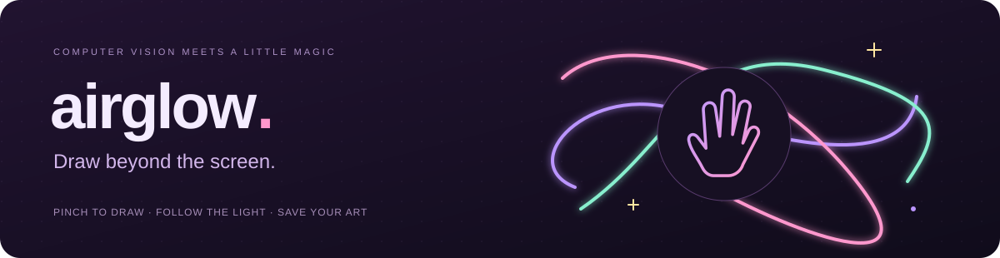
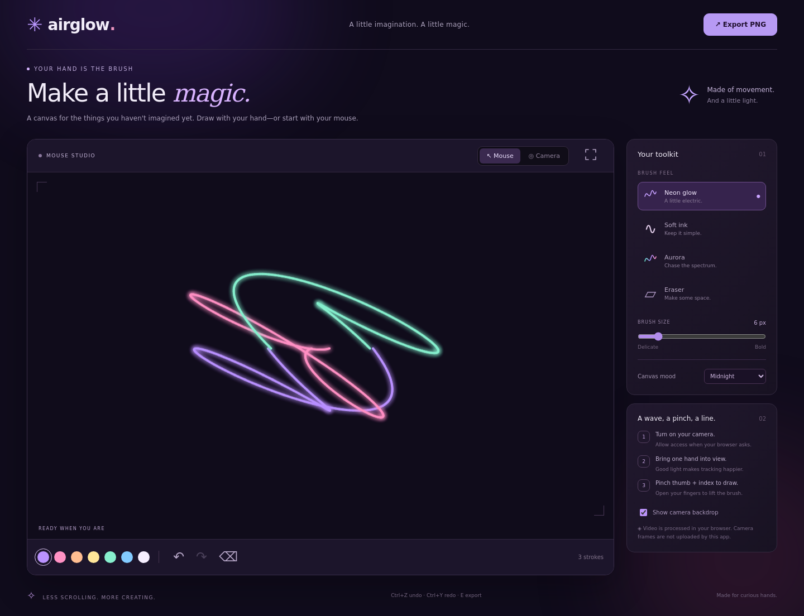
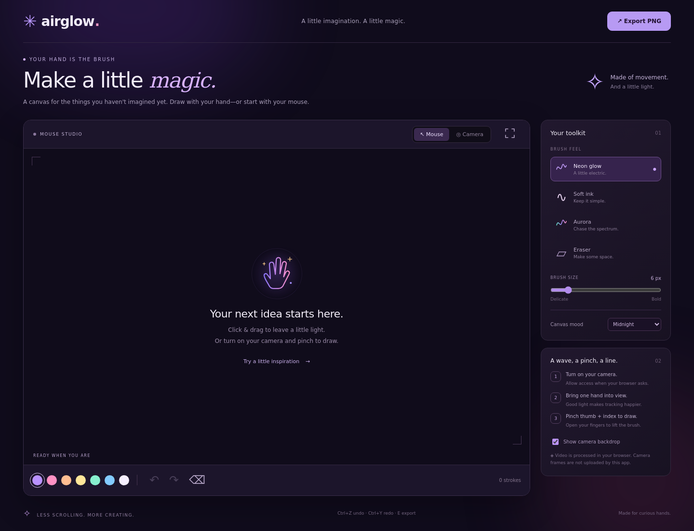
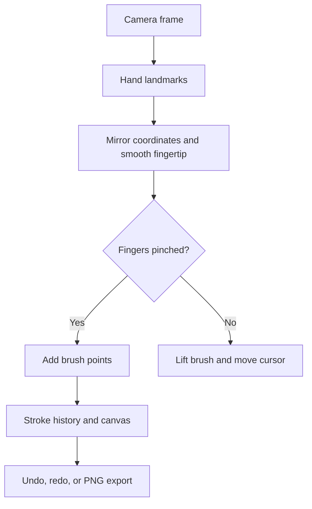

<div align="center">

# Airglow ✧
### My hand-controlled drawing studio

**A pinch, a little movement, and a trail of light.**

[See the studio](#take-a-look) · [Try it yourself](#run-it-on-your-computer) · [Pick a challenge](#your-first-five-minutes) · [Explore the code](#under-the-glow)

</div>



> **By Adwaith Nambiar** · Computer vision, gesture interaction, and creative coding  
> A local browser project created with AI assistance.

## Why I wanted to make this

After working on recommendation, classification, and object-tracking projects, I wanted to try something more playful: a project where you can see the result of your movement immediately.

Airglow turns your index finger into a brush. Pinch your thumb and index finger together, move your hand, and leave a glowing trail on the canvas. Open your fingers to lift the brush. It brings together two things I'm interested in: computer vision and interfaces that respond to the physical world.

I've run the project locally on my Windows computer. This repository shares the app, its verification checks, and the implementation details I'm exploring as I learn.

## Take a look



*An actual screenshot of the app showing its built-in example curves. These curves are generated by the drawing engine; they are not a demonstration of webcam tracking accuracy.*

<details>
<summary><strong>✧ Take a quick tour of the screenshot</strong></summary>

- **The big canvas** is your drawing space.
- **Mouse / Camera** switches between direct drawing and hand tracking.
- **The toolkit** changes brush style, thickness, and canvas mood.
- **The color dots** pick your next stroke's color.
- **The history controls** undo, redo, or clear your drawing.
- **Export PNG** saves the artwork without the surrounding interface.

The small fullscreen control expands the studio when you want more room.

</details>

<details>
<summary><strong>See the studio before drawing</strong></summary>



Start with the mouse, or select Camera and allow webcam access. The **Try a little inspiration** button adds three colorful example curves. Each curve can be undone individually.

</details>

## Your first five minutes

Pick a challenge, open its instructions, and give it a go.

<details>
<summary><strong>01 · Leave your signature</strong></summary>

1. Start in **Mouse** mode.
2. Choose **Neon glow** and your favorite color.
3. Write your initials with click-and-drag strokes.
4. Try **Undo**, redraw a letter, then export your first PNG.

**Try next:** switch to Camera and write the same initials with your hand.

</details>

<details>
<summary><strong>02 · Make a tiny constellation</strong></summary>

1. Choose **Midnight** for the canvas mood.
2. Use small **Snow** strokes to place a few stars.
3. Switch to **Sky** or **Lilac**, reduce the brush size, and connect them.
4. Give your constellation a name and save it.

A mouse click creates a dot. In camera mode, briefly pinch and release for each point.

</details>

<details>
<summary><strong>03 · Chase the spectrum</strong></summary>

1. Select **Aurora**.
2. Draw a long loop or spiral.
3. Watch the color change along the stroke.
4. Add a second curve with a different brush size.

The Aurora brush generates its own colors, so the selected palette color doesn't control that brush.

</details>

<details>
<summary><strong>04 · Make a transparent sticker</strong></summary>

1. Draw a small symbol, heart, or abstract shape.
2. Choose **Transparent export** under Canvas mood.
3. Click **Export PNG**.
4. Open the saved image in an editor or add it to a slide.

The exported PNG contains the drawing on a transparent background. The on-screen studio remains dark so you can still see the artwork.

</details>

## Run it on your computer

**Python 3.9 or newer + a modern browser. No pip install required.**

The hand-tracking runtime and pretrained model are bundled with the project. After downloading it, the app can run without fetching model assets from the internet.

### Windows: the quickest way

1. Download the project using **Code → Download ZIP**.
2. Extract the ZIP completely.
3. Open the folder containing `start.py`.
4. Double-click **start_windows.bat**.

The launcher opens **http://127.0.0.1:5005** in your browser. Keep the terminal open while using the app.

<details>
<summary><strong>Prefer Windows CMD? Copy these commands</strong></summary>

Clone the repository:

```bat
git clone https://github.com/adwaithnambiar2/airglow.git
cd airglow
py start.py
```

If you already downloaded the ZIP, open CMD in the folder containing `start.py` and run:

```bat
py start.py
```

If the Python launcher is unavailable, try `python start.py`.

</details>

<details>
<summary><strong>macOS / Linux instructions</strong></summary>

```bash
git clone https://github.com/adwaithnambiar2/airglow.git
cd airglow
python3 start.py
```

Open **http://127.0.0.1:5005** if the browser does not open automatically.

</details>

Press **Ctrl+C** in the terminal to stop the server. Open the app through the local server rather than double-clicking `index.html`.

## Turn your hand into a brush

| Step | What to do | What happens |
| --- | --- | --- |
| **1 · Connect** | Select Camera and allow webcam access | The app loads its local hand-tracking model |
| **2 · Find your hand** | Hold one hand in view with good lighting | The tracking overlay follows your hand |
| **3 · Pinch** | Bring thumb and index finger together | Drawing begins at the index fingertip |
| **4 · Move** | Keep pinching while moving your hand | Your selected brush paints a stroke |
| **5 · Release** | Separate your fingers | You can reposition without drawing |
| **6 · Keep it** | Click Export PNG | Your artwork downloads as an image |

Mouse mode supports click-and-drag drawing. Touch drawing uses the same pointer-event controls. Camera mode tracks one hand at a time.

> **Save your favorites:** drawings are held in memory. Refreshing or closing the page loses unsaved artwork.

## Find your favorite brush

| Brush | Personality | A good first experiment |
| --- | --- | --- |
| **Neon glow** | Bright strokes with a soft halo | Write your name in light |
| **Soft ink** | Simple lines without glow | Sketch a small character |
| **Aurora** | Colors shift along the stroke | Make a loop or spiral |
| **Eraser** | Removes painted pixels | Carve a shape into a thick stroke |

Choose from **Lilac · Rose · Peach · Sunbeam · Mint · Sky · Snow**. Adjust the brush between **2 and 32 pixels**, then pick **Midnight**, **Daydream**, or a **transparent export**.

<details>
<summary><strong>⌨ Keyboard shortcuts and little conveniences</strong></summary>

| Shortcut / control | Action |
| --- | --- |
| Ctrl+Z / Cmd+Z | Undo |
| Ctrl+Y / Cmd+Y | Redo |
| Ctrl+Shift+Z / Cmd+Shift+Z | Redo |
| E | Export PNG |
| Expand canvas | Enter fullscreen |
| Show camera backdrop | Toggle video behind the drawing |
| Clear canvas | Start fresh; undo restores the previous drawing |

PNG export includes your artwork and the selected background. Camera frames, hand landmarks, the dot grid, and controls are excluded. Erased areas remain transparent when exporting without a background.

</details>

## Under the glow

Airglow uses Google's pretrained **MediaPipe Hand Landmarker** to predict 21 landmarks from camera frames. The drawing interaction uses the index fingertip, thumb tip, wrist, and middle-finger base.

The thumb-to-index distance is divided by a palm-size reference. That makes the pinch decision less dependent on how close the hand is to the camera. Separate start and release thresholds help prevent rapid switching near the boundary.



<details>
<summary><strong>Open the implementation notes</strong></summary>

- **Pinch detection:** drawing starts below a distance ratio of `0.32` and continues until the ratio reaches `0.48`.
- **Smoothing:** each update moves the brush 45% of the way toward the detected fingertip.
- **Alignment:** coordinates are mirrored and adjusted to match the cropped webcam backdrop.
- **Inference:** detection is limited to approximately 20 updates per second. Actual speed depends on the device.
- **History:** normalized stroke coordinates support redraws after resizing. Undo and redo operate on stored strokes.
- **Clear:** a history marker makes clearing undoable.
- **Rendering:** Canvas 2D draws the strokes, glow, and erasing effects.

These are choices to explore and tune. They are not a benchmark of gesture recognition accuracy.

</details>

| Part | Technology |
| --- | --- |
| Hand tracking | MediaPipe Tasks Vision 0.10.21 + pretrained Hand Landmarker |
| Interface | HTML, CSS, JavaScript modules |
| Artwork | HTML Canvas 2D |
| Local server | Python standard library |
| Unit tests | Node.js built-in test runner |

**Model experience represented here:** local inference with a pretrained model. This project does not train or fine-tune that model.

## What I'm exploring

This project gives me a way to connect computer vision output to something I can interact with immediately. The parts I'm interested in understanding more deeply are how smoothing affects responsiveness, how pinch thresholds affect control, and how tracking coordinates stay aligned with the mirrored camera view.

<details>
<summary><strong>Ideas I'd like to try next</strong></summary>

These are future experiments, not implemented features:

- [ ] Adjustable pinch sensitivity and smoothing
- [ ] Automatic local saving and restoring of artwork
- [ ] Moving inference into a worker to reduce UI blocking
- [ ] A small gesture evaluation across lighting and hand distances
- [ ] Recording the drawing process as a time-lapse

</details>

## Verification and honest limits

The project includes **nine passing unit tests** and browser checks for drawing, history, export, layout, and model execution. The recorded checks are in [verification.json](reports/verification.json).

<details>
<summary><strong>What was checked?</strong></summary>

- Mouse drawing and undo/redo
- Undoable clearing and built-in example curves
- Opaque and transparent PNG downloads
- A 390-pixel mobile viewport without horizontal overflow
- Actual bundled model initialization and inference on simulated camera frames
- Camera-stream cleanup when returning to Mouse mode

The browser checks used Chromium 134 through Playwright. Simulated camera frames confirm model execution, not physical webcam gesture accuracy. I've also run the app locally on Windows; that is a hands-on check, not a measured accuracy study.

</details>

<details>
<summary><strong>Where can it struggle?</strong></summary>

Low light, hand occlusion, fast movement, and moving out of frame can disrupt tracking. Pinch thresholds are fixed. Inference runs synchronously on the browser's main thread, so slower devices can feel less responsive. Long drawing sessions accumulate history in memory, and there is no automatic save.

The project is a local creative prototype with one-hand tracking.

</details>

<details>
<summary><strong>Run the tests yourself</strong></summary>

Unit tests require Node.js 20 or newer. Node is not required to use the drawing app.

```bash
npm test
```

Optional browser checks require Python Playwright:

```bash
python -m pip install playwright==1.51.0
python -m playwright install chromium
python tests/browser_smoke.py
```

The browser test uses simulated camera input and saves screenshots and sample exports locally.

</details>

## Camera and privacy

The app requests **video only** when you select Camera. Frames are processed in your browser. Airglow contains no frame-upload endpoint or analytics, and its runtime assets are included locally.

Switching to Mouse or hiding the tab stops the camera stream. Select Camera again to restart it. Hiding the video backdrop only changes what you see; tracking remains active.

## A note on AI assistance

I used AI assistance to generate the initial code and visual design, help debug issues, write tests, and prepare the documentation. I set up and ran the project on my Windows computer and published it here as an AI-assisted learning project.

The hand-tracking model is Google's pretrained MediaPipe model. The screenshots show the actual interface, and the verification notes distinguish example artwork, simulated-camera checks, and hands-on use.

## Find your way around

| File | What to explore |
| --- | --- |
| [index.html](index.html) | Studio layout and controls |
| [static/style.css](static/style.css) | Colors, spacing, and responsive design |
| [static/app.js](static/app.js) | Camera lifecycle, gestures, UI, and export |
| [static/core.js](static/core.js) | Pinch logic, coordinate mapping, strokes, and history |
| [start.py](start.py) | Local HTTP server |
| [tests/core.test.js](tests/core.test.js) | Drawing and gesture unit tests |
| [tests/browser_smoke.py](tests/browser_smoke.py) | Optional browser verification |
| [vendor/mediapipe/](vendor/mediapipe/) | Bundled runtime and pretrained model |

## Need a little help?

<details>
<summary><strong>The launcher closes or Python isn't found</strong></summary>

Open CMD in the folder containing `start.py` and run `py start.py` to see the error. Try `python start.py` if the Python launcher is unavailable. Python 3.9 or newer is required.

</details>

<details>
<summary><strong>The browser won't use my camera</strong></summary>

Open **http://127.0.0.1:5005**, allow camera access in the browser's site settings, and close other apps that might be using the webcam. Mouse mode remains available.

</details>

<details>
<summary><strong>My lines are shaky or keep breaking</strong></summary>

Use brighter light, keep the entire hand in view, move slowly, and pinch clearly. Try drawing near the center of the camera view. Turning off the backdrop changes visibility, not inference speed.

</details>

<details>
<summary><strong>Port 5005 is already in use</strong></summary>

Stop the previous Airglow terminal with Ctrl+C and try again. Alternatively, change `5005` consistently in `start.py` and open the matching address.

</details>

## Credits

- [MediaPipe Hand Landmarker](https://ai.google.dev/edge/mediapipe/solutions/vision/hand_landmarker/web_js) — pretrained hand tracking
- [Third-party notices](THIRD_PARTY_NOTICES.md) — bundled components and sources
- [MIT License](LICENSE) — original project code
- [MediaPipe license](vendor/mediapipe/LICENSE) — bundled third-party licensing

<div align="center">

**Made by Adwaith Nambiar, with curiosity and AI assistance.**  
*Make something that only your hand could make. ✧*

[Back to the top](#airglow-)

</div>
